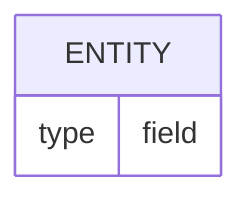

# (Database doc title)

## Overview

Description of the database component being documented.

## Schema

### Table: `table_name`

| Column | Type | Nullable | Default | Description |
|---|---|---|---|---|
| id | UUID | NO | gen_random_uuid() | Primary key |
| | | | | |

#### Indexes
- `idx_name` on `column`

#### Constraints
- Foreign key: `column` references `other_table(id)`

### Views

### Functions / Stored procedures

## Migrations

| Migration | Description | Status |
|---|---|---|
| | | |

## Relationships

## Related

- `architecture/<domain>.md`
